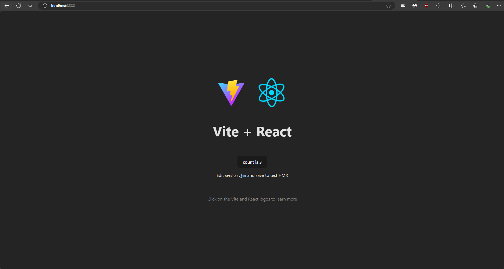
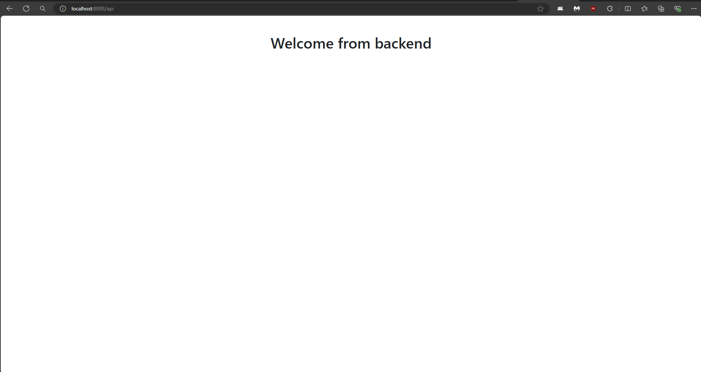

# ReactViteSpring

## Screenshots



## PROXY SERVER INCLUDED

```
http://localhost:8888 -> REACT + VITE
http://localhost:8888/api -> SPRING BACKEND
```

## Installation
* use the installation script, install.ps1 (you will need to run as administrator)
```
powershell -ExecutionPolicy ByPass -File .\install.ps1
```
* Install NodeJS dependencies
```
npm install
```

## RUN
To run the app
- It will run React + Vite
- Build Spring App
```
npm run dev
```


This template provides a minimal setup to get React working in Vite with HMR and some ESLint rules.

Currently, two official plugins are available:

- [@vitejs/plugin-react](https://github.com/vitejs/vite-plugin-react/blob/main/packages/plugin-react/README.md) uses [Babel](https://babeljs.io/) for Fast Refresh
- [@vitejs/plugin-react-swc](https://github.com/vitejs/vite-plugin-react-swc) uses [SWC](https://swc.rs/) for Fast Refresh
